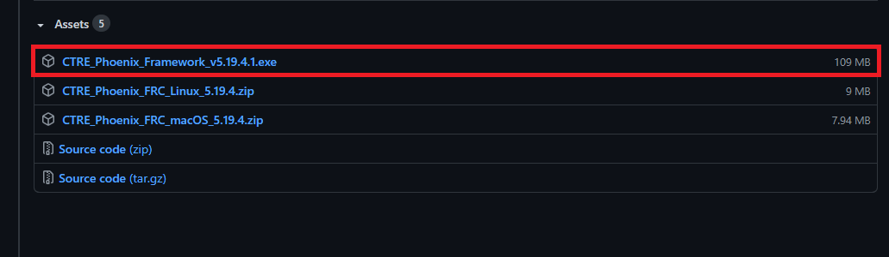
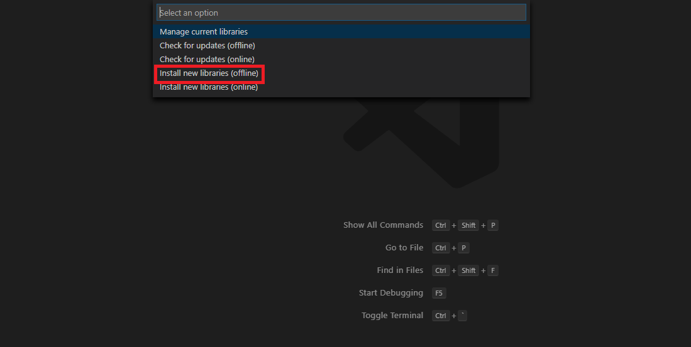
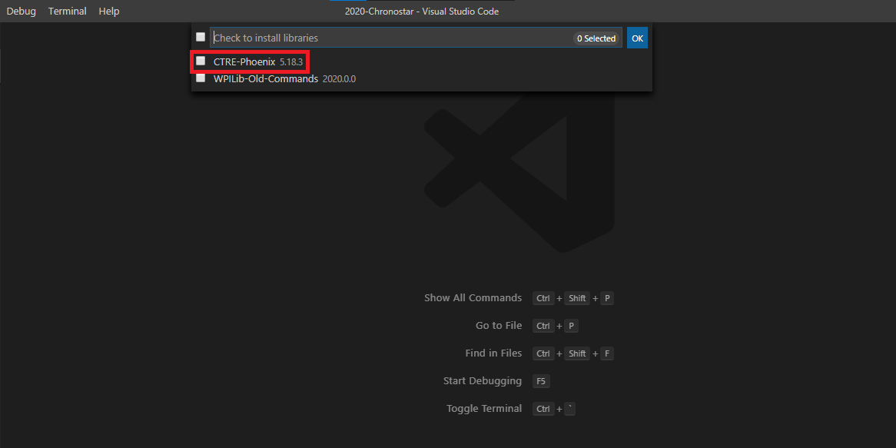
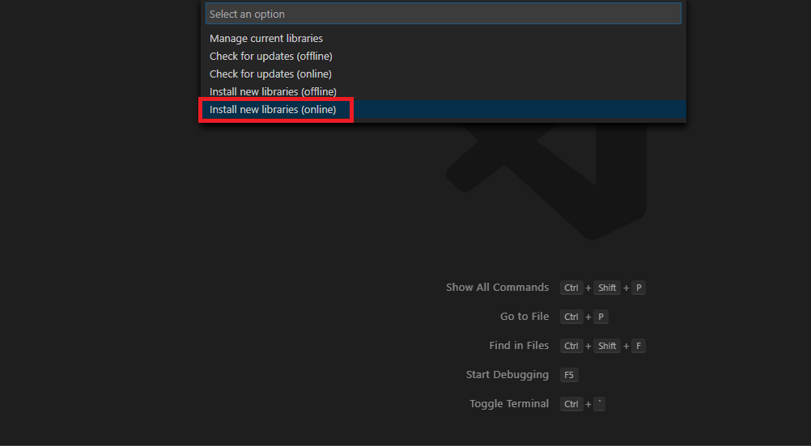

# Libraries

Installation instructinos for the libraries that we use in our projects are (typically) Cross the Road Electronics, Kauai Labs, and REV Robotics, along with WPILib.

## Cross the Road Electronics

1. Go to [this link](https://github.com/CrossTheRoadElec/Phoenix-Releases/releases)

2. Download the Phoenix Installer 

3. Execute the Phoenix installer

4. Go through the installation wizard

5. In VS Code, hit `Ctrl + Shift + P` and type in **WPILib: Manage Vendor Libraries**

6. Select **Install new library (offline)**   

7. Click the check on CTRE-Phoenix 

---

## REV Robotics

1. Copy this URL: `https://www.revrobotics.com/content/sw/max/sdk/REVRobotics.json`

2. In VS Code, hit `Ctrl + Shift + P` and type in **WPILib: Manage Vendor Libraries**

3. Select **Install new library(online)**   
4. Paste the URL into the bar up top

---

## Kauai Labs

1. Copy this URL: `https://www.kauailabs.com/dist/frc/2021/navx_frc.json`

2. In VS Code, hit `Ctrl + Shift + P` and type in **WPILib: Manage Vendor Libraries**

3. Select **Install new library(online)**  
4. Paste the URL into the bar up top
