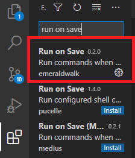
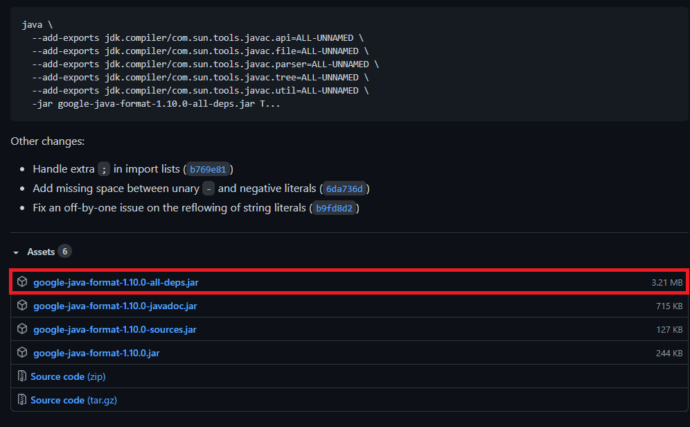

# Setting up the Java Linter

Installation steps for the Java linter.

## Setup

1. Add `C:\Users\Public\wpilib\jdk\bin` to the PATH

2. Go to the extension market, and add emeraldwalk's run on save to VS Code 

3. Install the latest .jar from [this site](https://github.com/google/google-java-format/releases) 

4. In VS Code, hit `Ctrl + Shift + P` and type in **Preferences: Open Settings (JSON)**
5. Anywhere inside the first brackets, add this code:

```json
"emeraldwalk.runonsave": {
    "commands": [
      {
        "match": "\\.java$",
        "cmd": "java -jar C:\\Users\\Public\\wpilib\\2021\\google-java-format-1.10.0-all-deps.jar --aosp --replace ${file}"
      },
    ],
  },
```
